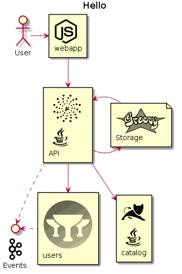

# Micronaut PlantUML sprites

This repository contains PlantUML sprites which can easily be used in PlantUML diagrams for nice visual representation of popular technologies.

This project is inspired in other PlantUML sprites repositories like [AWS-PlantUML](https://github.com/milo-minderbinder/AWS-PlantUML) and [PlantUML Icon-Font Sprites](https://github.com/tupadr3/plantuml-icon-font-sprites).
and [Cloudinsight PlantUML sprites](https://github.com/rabelenda/cicon-plantuml-sprites)

## Usage

Just import the proper sprite into your PlantUML diagram and use it like any other sprite.

Example:

```
@startuml
!define SPRITESURL https://raw.githubusercontent.com/rabelenda/cicon-plantuml-sprites/v1.0/sprites
!define PVIDAURL https://raw.githubusercontent.com/jagedn/mn-plantuml-sprites/master/sprites/

!includeurl SPRITESURL/java.puml
!includeurl SPRITESURL/nodejs.puml
!includeurl SPRITESURL/kafka.puml
!includeurl SPRITESURL/tomcat.puml

!includeurl PVIDAURL/micronaut.puml
!includeurl PVIDAURL/groovy16.puml
!includeurl PVIDAURL/grails.puml


title Hello


actor User
rectangle "<$nodejs>\nwebapp" as webapp

rectangle "<$micronaut>\n<$java>\nAPI" as api
interface "<$kafka>\nEvents" as kafka
file "<$groovy>\nStorage" as repo
rectangle "<$tomcat>\n<$java>\ncatalog" as catalog
rectangle "<$grails>\nusers" as users

User -> webapp
webapp --> api
api -> repo
repo -> api
api ..> kafka
api --> catalog
api --> users
kafka <. users
@enduml
```




## Note

* All logo icons are the registered trademarks of their respective owners.
